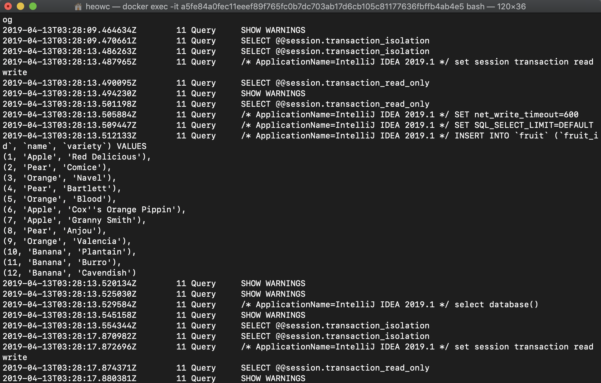
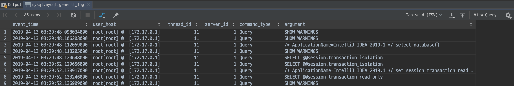

# MySQL Query Log

query log를 쌓고 이를 확인할 수 있는 설정은 기본적으로 비활성화되어 있다. 이를 확인하기 위해선 다음 명령어를 통해 알 수 있다.

```bash
mysql> show variables like '%log%';
+------------------------------------------------+---------------------------------------------+
| Variable_name                                  | Value                                       |
+------------------------------------------------+---------------------------------------------+
|  ...                                                                                         |
| general_log                                    | OFF                                         |
| general_log_file                               | /var/lib/mysql/a5fe84a0fec1.log             |
| ...                                                                                          |
| log_output                                     | NONE                                        |
| log_queries_not_using_indexes                  | OFF                                         |
| ...                                                                                          |
| slow_query_log                                 | OFF                                         |
| slow_query_log_file                            | /var/lib/mysql/a5fe84a0fec1-slow.log        |
| ...                                                                                          |
+------------------------------------------------+---------------------------------------------+
82 rows in set (0.02 sec)
```

물론 더 많은 로그 관련 설정도 많으나, 간단하게 알아보기 위해 위에 내용만 보자.

### general_log

DB에서 모든 쿼리를 로깅하는 기능이다. `SET GLOBAL general_log='ON'`으로 켤 수 있음

### general_log_file

`log_output=FILE` 경우, general_log를 쓸 파일 위치와 이름.





### log_output

로그를 어떤식으로 모아둘지 정하는 타입 (NONE, FILE, TABLE)

### log_queries_not_using_indexes

인덱스를 안타는 쿼리를 로기하는 기능.

### slow_query_log

느린 쿼리를 로깅하는 기능. `long_query_time` 값을 기준으로 함.

### slow_query_log_file

`general_log_file` 비슷


## 참고

- https://docs.aws.amazon.com/ko_kr/AmazonRDS/latest/UserGuide/USER_LogAccess.Concepts.MySQL.html